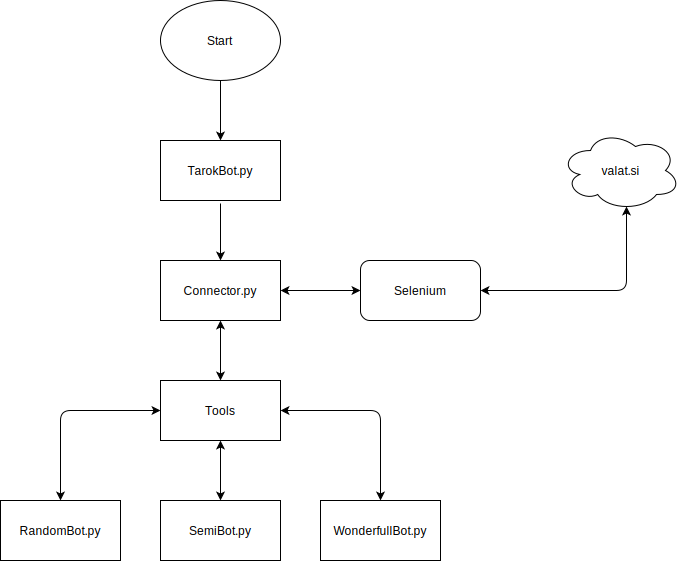

# tarok_bot
Some info:
<li>Supported browsers: <b>Chrome</b></li>
<li>MySQL script is in DatabaseComponent. To turn database on set 'write_to_database' to 'yes'.</li>
<li>Admin tool is turned on by 'start_admin' parameter. Only 'set' and 'reset' work without the database. 'reset' stops the bot and after you click 'set' it goes to state for a new round.</li>
 
Startup:
<li>Create txt file and name it 'user_config.txt'. Save it into 'resources' folder</li>
<li>If the parameter 'is_pass_encoded' in the configuration.txt is set to 'yes' then you have to encode your gmail password to base64. Otherwise set it to 'no'.</li>
<li>In the 'user_config.txt' file put gmail and raw or encoded password for your gmail account in the line 1 and 2</li>
<li>Select bot difficulty in the configuration.txt with the 'playing_bot' parameter.</li>
<li>Run 'TarokBot.py'</li>
<li>Make sure that the rounds are played Counter-Clockwise</li>
 

 

Version 0.8 Random and Semi bot work
